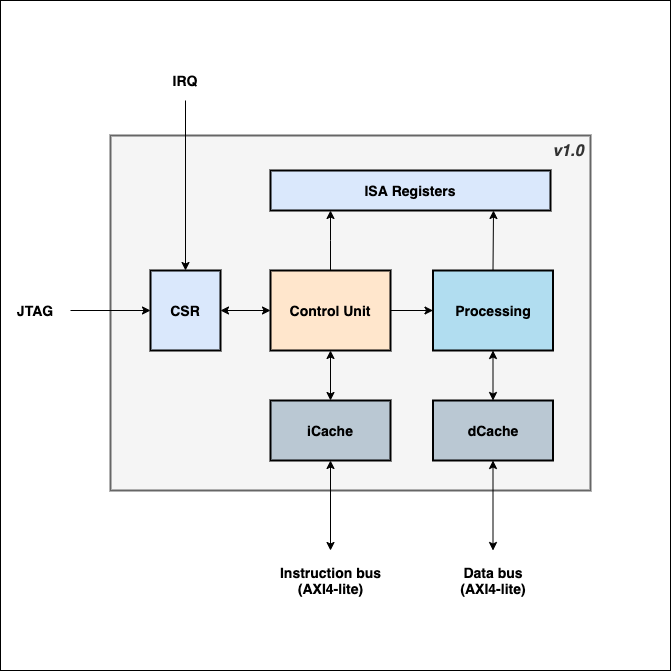

# FRISCV

## Overview

FRISCV is a SystemVerilog implementation of  [RISCV ISA](https://riscv.org):

- Support RV32I & RV32E instruction sets
- 2-stage pipeline
- In-order execution
- Instruction cache
- AXI4-lite instruction and data interfaces
- Machine-mode only

  <!--img width="100" height="100" src=""-->
  

To be implemented next:

- New ISA extensions (mult/div, FP, ...)
- Interrupt
- Timer
- Privileged instruction
- Data cache stage
- 64 bits architecture
- ... and many more :)

The core is verified with SystemVerilog and Assembler, two testsuites are
present in [test](./test) folder:
- [In-house Assembler Testsuite](./test/asm_testsuite/README.md)
- [RISCV Compliance Testsuite](./test/riscv-tests/README.md)

This is work in progress... but an active work !

## License

This IP core is licensed under MIT license. It grants nearly all rights to use,
modify and distribute these sources. However, consider to contribute and provide
updates to this core if you add feature and fix, would be greatly appreciated :)
