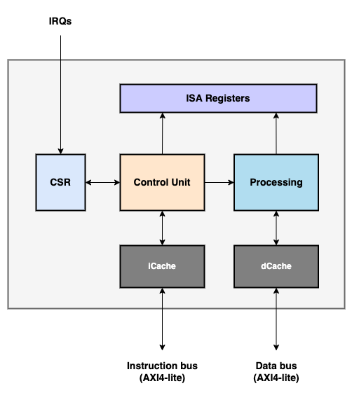

                         ███████╗██████╗ ██╗███████╗ ██████╗██╗   ██╗
                         ██╔════╝██╔══██╗██║██╔════╝██╔════╝██║   ██║
                         █████╗  ██████╔╝██║███████╗██║     ██║   ██║
                         ██╔══╝  ██╔══██╗██║╚════██║██║     ╚██╗ ██╔╝
                         ██║     ██║  ██║██║███████║╚██████╗ ╚████╔╝
                         ╚═╝     ╚═╝  ╚═╝╚═╝╚══════╝ ╚═════╝  ╚═══╝

# Overview

FRISCV is a SystemVerilog implementation of the [RISCV ISA](https://riscv.org):

- Support RV32I & RV32E architecture
- Support Zifencei
- Support Zicsr
- Support M extension (multiply/divide)
- Machine-mode only
- Implement a 3-stage pipeline
- Support global and software interrupts
- Implement timer
- In-order execution
- Provide an instruction cache
- Use AXI4-lite for instruction and data bus

The core is [compliant](./test/riscv-tests/README.md) with the official RISCV
testsuite.

# [Architecture](./doc/architecture.md)

  <!--img width="100" height="100" src=""-->
  

The IP is decribed in two layers:
- the core, a RISCV hart to execute an assembler program
- the platform, instantiating a hart, an AXI4 crossbar and the peripherals

The core is compact and composed by:
- the control unit, fetching and sequencing the instructions
- the processing unit, executing the arithmetic and memory access instructions
- the cache units
- the CSR unit, providing the registers to connect the features and extensions
- the ISA registers, shared between control and processing units

More details of the architecture can be found in the:
- Architecture [chapter](./doc/architecture.md).
- IOs and parameters [chapter](./doc/ios_params.md)

## Verification environment

The core is verified with Assembler within two testsuites, present in
[test](./test) folder:
- [White-BoxAssembler Testsuite](./test/wba_testsuite/README.md)
- [RISCV Compliance Testsuite](./test/riscv-tests/README.md)

 The flow relies on:

- [Icarus Verilog 11](https://github.com/steveicarus/iverilog)
- [Verilator 4.2](https://github.com/verilator)
- [SVUT](https://github.com/dpretet/svut) to configure and execute Icarus

The RISCV compliance testsuite is the official testsuite provided by RISCV
foundation, adapted the core and its environment platform. The White-Box ASM
testsuite has been developed for the purpose of this project and targets
specific instructions sequence.

## Validation environment

The core has not been yet tested on hardware, but a synthesis flow based in [Yosys](https://github.com/YosysHQ/yosys)
is available in [syn](./syn) folder.

# [Development plan](doc/project_mgt.md)

Ongoing:

- Development of ASM and C programs to test the processor with real use cases and benchmark it

Next:

- Counters
- Supervisor & user mode
- Support F extension with Berkeley Hardfloat core
- Data cache stage
- 64 bits architecture
- JTAG interface for debugging purpose
- ... and many more :)

# License

This IP core is licensed under MIT license. It grants nearly all rights to use,
modify and distribute these sources.

However, consider to contribute and provide updates to this core if you add
feature and fix, would be greatly appreciated :)
