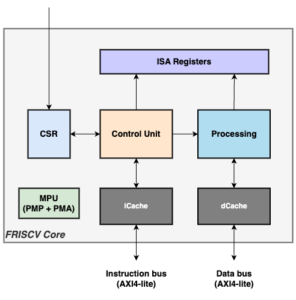

     ███████╗██████╗ ██╗███████╗ ██████╗██╗   ██╗
     ██╔════╝██╔══██╗██║██╔════╝██╔════╝██║   ██║
     █████╗  ██████╔╝██║███████╗██║     ██║   ██║
     ██╔══╝  ██╔══██╗██║╚════██║██║     ╚██╗ ██╔╝
     ██║     ██║  ██║██║███████║╚██████╗ ╚████╔╝
     ╚═╝     ╚═╝  ╚═╝╚═╝╚══════╝ ╚═════╝  ╚═══╝

# Overview

FRISCV is a SystemVerilog implementation of the [RISCV ISA](https://riscv.org):

- Built around a 3-stage pipeline
- In-order execution
- AXI4-lite for instruction and data bus
- Instruction & data cache units
- Privilege modes:
    - Machine-mode only for simple embedded system
    - User-mode for secure embedded system
- Physical memory protection (PMP)
- Physical memory attribute (PMA)
- External, software and timer interrupts
- Support multiple (optional) extensions:
    - RV32I & RV32E architecture
    - Zifencei
    - Zicsr
    - Zicntr
    - Zihpm
    - M extension (multiply/divide)
    - Clint extension

The core is [compliant](./test/riscv-tests/README.md) with the official RISCV
testsuite.

# [Architecture](./doc/architecture.md)

  <!--img width="100" height="100" src=""-->
  

The IP is decribed in two layers:
- the core, a RISCV hart to execute an assembler program
- the platform, instantiating a hart, an AXI4 crossbar and the peripherals

The core is compact and composed by:
- the control unit, fetching and sequencing the instructions
- the processing unit, executing the arithmetic and memory access instructions
- the cache units, one for instruction, one for data bus
- the CSR unit
- the ISA registers
- the memory protection unit for less-privilege mode memory access

More details of the architecture can be found in the:
- Architecture [chapter](./doc/architecture.md).
- IOs and parameters [chapter](./doc/ios_params.md)

## Verification environment

The core is verified with several testsuites, present in [test](./test) folder:
- [White-Box Assembler testsuite](./test/wba_testsuite/README.md)
- [Privilege / Security testsuite](./test/priv_sec_testsuite/README.md)
- [RISCV Compliance testsuite](./test/riscv-tests/README.md)
- [C testsuite](./test/c_testsuite/README.md)
- [Apps testsuite](./test/apps/README.md)
- [SV testsuite](./test/sv/README.md)

 The flow relies on:

- [Icarus Verilog 11](https://github.com/steveicarus/iverilog)
- [Verilator 4.2](https://github.com/verilator)
- [SVUT](https://github.com/dpretet/svut)
- [RISCV toolchain](https://github.com/riscv-collab/riscv-gnu-toolchain)

## Validation environment

The core has not been yet tested on hardware, but a synthesis flow based in [Yosys](https://github.com/YosysHQ/yosys)
is available in [syn](./syn) folder.

# Development plan

- [HW development plan](doc/project_mgt_hw.md)
- [SW development plan](doc/project_mgt_sw.md)

# License

This IP core is licensed under MIT license. It grants nearly all rights to use,
modify and distribute these sources.

However, consider to contribute and provide updates to this core if you add
feature and fix, would be greatly appreciated :)
