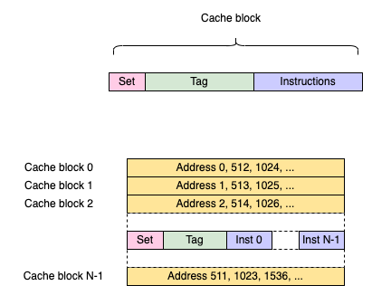

# Architecture

## Core Architecture

  

The core is compact and composed by:
- the control unit, fetching and sequencing the instructions
- the processing unit, executing the arithmetic and memory access instructions
- the cache units, at the moment only the instruction cache is available
- the CSR unit, providing the registers to connect the features and extensions
- the ISA registers, shared between control and processing units

### Interfaces Protocol

The core connects internally its modules with AMBA philosophy. AMBA proposes
a simple way to connect and transfer data between two modules by handshaking
with a simple `VALID`/`READY` schema. A master module, driving information
to a slave, asserts its `VALID` control signal as soon it can transfer a new
information, and can't deassert it before a handshake. A slave can accept
whenever it wants the transaction by asserting its `READY` control signal. These
simple transaction rules ensure no deadlock can occur and introduce natively
back-pressure through a data & control flow across a core.

The core widely uses AMBA specification. The most simple AMBA communication is an
AXI4-Stream channel, a point-to-point channel carrying data + metadata,
handshaking with a `TVALID`/`TREADY` pair. `TDATA` (the payload) is
considered transfered when both `TVALID` and `TREADY` are synchronously
asserted high in the same clock cycle.

Most of the modules use this AXI4-stream philosophy. When data to transfer
requires a memory-oriented access, the core uses AXI4-lite or AXI4. Control unit and
data memory controller use AXI4-lite while the cache layers use AXI4 to
transfer a biggest amount of data (AXI4-lite can transfer a single dataphase
while AXI4 can move up to 256 dataphases). AXI4-lite/AXI4 are splitted-transaction
protocols, still relying on the rule explained above to handshake, using
several channels:

- Write address channel: carry address to write and additional info
- Write data channel: data to write to the targeted address
- Write reponse channel: reponse of the slave after the write transaction
- Read address channel: carry address to read and additional info
- Read data channel: slave response carrying the data read at the read address

Using a splitted-transaction protocol avoid useless blocking state during an
access and enhance significantly the global bandwidth of the core and so its
performance. It also induces support of outstanding requests, being able to
perform read/write request ahead a data transmission/reception.

The core uses IDs to identify the transactions when using AXI4-lite, which is
an optional feature but which permits an easy translation from/to AXI4. More
information about AMBA can be found in the
[ARM](https://developer.arm.com/documentation/ihi0022/e?_ga=2.67820049.1631882347.1556009271-151447318.1544783517)
website.

### Control Unit

  

The control unit is the central piece of the core. It acts as a sequencer to
fetch and distribute instructions across the hart. The unit is composed by
several pieces:

- The central FSM sequencing the execution
- The program counter management based on current instruction to execute
- A FIFO to buffer the incoming instructions
- An instruction decoder to decompose the machine code and ease the processing

  

The FSM sequencing the operations manages the PC (program counter) and acts
depending the incoming instructions. It activates the processing unit, manages
the jump/branch instruction or read/write the CSRs.

The control unit fetches the next instructions through an AXI4-lite interface,
using its non-blocking nature to read multiple outstanding requests and so
unleash the performance of the core. In case a jump or a branching is
necessary, it will drop the next useless incoming requests and reboot a new
batch of requests up to the next jump.

  

The above figure illustrates a processor booting at address `0x0`, issuing multiple
outstanding requests. Addresess from `0x0` to `0x2` return instructions to execute in the
next cycle but address `0x3` returns a JAL (jump) to move to address `0xA`. So
outstanding requests coming back with addresses `0x4` and `0x5` are discarded and
only instructions from `0xA` will be used. To identify this new memory section read,
the control unit increments the address channel ID when jumping to ease this
batch identification.

The FIFO present as a front-end of the module is very important to store
incoming instructions in case the processing unit, the CSRs are not ready to
execute an instruction (for instance if reading the external central memory).

The controls unit also manages the exceptions occuring and the traps
(asynchronous or synchronous).

### Processing Unit

The processing unit encloses the memory controller managing LOAD/STORE
instructions and the ALU unit managing the arithmetic and logical instructions.
It's nowadays very simple and executes the instructions in-order.

  

Later this unit will be enhanced to support more extensions like mult, div or
even better multiple instructions in the same cycle, why not in a out-of-order
way.

### Cache Units

At this moment, only an instruction cache is available in the core. A data
cache module is present but can only manages AXI4-lite to AXI4 interface
conversion when using the [platform](../rtl/friscv_rv32i_platform.sv).

#### Instruction Cache

  

The instruction cache stage acts a local buffer storing the most frequently
used instructions to avoid doing read requests to the central memory, which
would take significantly longer time to be accessed than a local memory. This
stage increases the bandwidth when fetching the next instructions to process
and thus increases the overall processor performance.

Features:

- Direct-mapped placement policy
- Parametrizable cache depth
- Parametrizable cache line width
- Software-based flush control with FENCE.i instruction
- Transparent operation for user, no need of any kind of management
- Cache prefetch can be activated in the internal memory controller to enhance efficiency
- AXI4-lite slave interface to fetch an instruction
- AXI4 master interface to read the system memory

Explanations about the basics of cache layers can be found in this [document](./cache_layers.md).

The cache unit is built around the central FSM, the fetcher stage:

  

The fetch stage receives the read request from the control unit and parses the caches blocks to
find the requested instructions. The fetcher uses two FIFOs, one to store the incoming requests,
the other to store the cache-miss requests. As long the instructions are available in the cache,
the fetcher uses the first FIFO; once a cache-miss is reached, the missing address is stored in the
second FIFO. Then, the memory controller reads the central memory with the missing address and fills
the cache blocks to serve again the cache-miss FIFO. The fetcher stage navigates back and forth
between the two FIFOs, between the cache blocks and the memory controller.

  

The cache blocks are organized with a direct-mapped cache architecture. Each line width can be
configured as well the number of cache lines (the cache depth). Each line stores the tag, the
instuctions and the set bit. The tag is the part of an address's MSB used to identify the real
address stored, the set bit indicates if this lines as been already written or not.

  

The above figure illustrates how an address is exploited to organize and retrive an instruction:

addr = | tag | index | offset |

- offset: log2(nb instructions per block), selects the right instruction in the cache block
- index:  log2(cache depth), selects a cache block in the pool
- tag:    the remaining MSBs, the part helping to determine a cache hit/miss

### CSR Unit

The core implements in a dedicated module the supported registers described in the ISA manuel
volume 2 (privileged specification).

The core implements the following CSR registers into the dedicated module:

- mhartid (RO)
- mstatus (RW)
- misa (RW)
- mie (RW)
- mip (RW)
- mtvec (RW)
- mcounteren (RW)
- mscratch (RW)
- mepc (RW)
- mcause (RW)
- mtval (RW)

Next CSRs are available as memory-mapped peripheral:

- mtime (RO)
- mtimecmp (RW)

They are not available if using only the [core](../rtl/friscv_rv32i_core.sv)
module and not its ready-to-use [platform](../rtl/friscv_rv32i_platform.sv)
module including the core and an AXI4 crossbar to connect the peripherals.

## Platform

  

The FRISCV platform is a top layer instanciating the core, an [AXI4 crossbar](https://github.com/dpretet/axi-crossbar),
and multiple peripherals to interact with external environment. The platform reserves an AXI4
master interface to connect a RAM, for instance a DDR controller. This interface can be used
by instruction and data buses. The platform also provides GPIOs (up to XLEN width), and an UART.

### Interrupts

The core supports few interrupts:

- global IRQ: an input from any external source
- software IRQ: an input from another hart (MSIP)
- timer IRQ: mtime & mtimecmp CSRs, connected a memory-mapped peripheral

The core proposes also an MSIP output, located in a memory-mapped peripheral to
trigger another hart. The mtime/mtimecomp/MSIP output interrupt are basic
interrupt, most commonly named CLINT.

The core always handles in its clock domain the interrupts by synchronizing them through a
two-stage FFDs.

### IOs

The IOs are connected to a master port of the crossbar through am APB interconnect. Both the IO
modules use APB protocol, so requests from the core are first translated from/to AXI4-lite.

#### GPIOS

The GPIOs are binded behind two registers:

> Register 0 - Address 0 - 32 bits wide - Outputs

> Register 1 - Address 0 - 32 bits wide - Inputs

Reading and writing to the GPIOs is never blocking.

#### UART

The UART uses few IOs:

- rx: serial input, data from an external transmitter
- tx: serial output, data to an external receiver
- rts: back-pressure to indicate the UART receiver can't receive anymore data
- cts: back-pressure to indicate the external receiver can't receive data anymore

The UART uses a FIFO to store data to transmit, and another to store data
received. If the FIFOs are full, the UART can't receive anymore data and rises
the RTS flag, or can't transmit anymore and block the APB bus until the
receiver desasserts its CTS flag.

The UART owns few registers. Any attempt to write in a read-only [RO] register
or a reserved field will be without effect and can't change the register
content neither the engine behavior. RW registers can be written partially by
setting properly the WSTRB signal.

Register 1, setting up the baud rate, can be changed anytime like any register;
but an update during an ongoing operation will certainly lead to compromise the
transfer integrity and possibly make unstable the UART engine. The user is
advised to configure the baud rate during start up and be sure the engine is
disabled before changing this value.

If a transfer (RX or TX) is active and the enable bit is setup back to 0, the
transfer will terminate only after the complete frame transmission

Register 0: Control and Status [RW] - Address 0 - 16 bits wide

- bit 0     : Enable the UART engine (both RX and TX) [RW]
- bit 1     : Loopback mode, every received data will be stored in RX
              FIFO and forwarded back to TX [RW]
- bit 2     : Enable parity bit [RW]
- bit 3     : 0 for even parity, 1 for odd parity [RW]
- bit 4     : 0 for one stop bit, 1 for two stop bits [RW]
- bit 7:5   : Reserved
- bit 8     : Busy flag, the UART engine is processing (RX or TX) [RO]
- bit 9     : TX FIFO is empty [RO]
- bit 10    : TX FIFO is full [RO]
- bit 11    : RX FIFO is empty [RO]
- bit 12    : RX FIFO is full [RO]
- bit 13    : UART RTS, flagging it can't receive anymore data [RO]
- bit 14    : UART CTS, flagging it can't send anymore data [RO]
- bit 15    : Parity error of the last RX transaction [RO]
- bit 31:16 : Reserved

Register 1: UART Clock Divider [RW] - Address 1 - 16 bits wide

The number of CPU core cycles to divide down to get the UART data bit
rate (baud rate).

- Bit 15:0  : Clock divider
- Bit 31:16 : Reserved

Register 2: TX FIFO [RW] - Address 1 - 8 bits wide

Push data into TX FIFO. Writing into this register will block the APB
write request if TX FIFO is full, until the engine transmit a new word.

- Bit 7:0  : data to write
- Bit 31:8 : Reserved

Register 3: RX FIFO [RO] - Address 1 - 8 bits wide

Pull data from RX FIFO. Reading into this register will block the APB
read request if FIFO is empty, until the engine receives a new word.

- Bit 7:0  : data ready to be read
- Bit 31:8 : Reserved

Current limitations
- only support 8 bits wide data word
- no parity support
- no loopback mode
