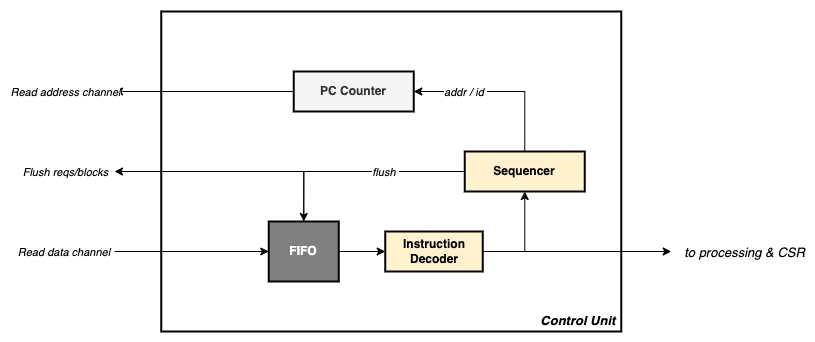
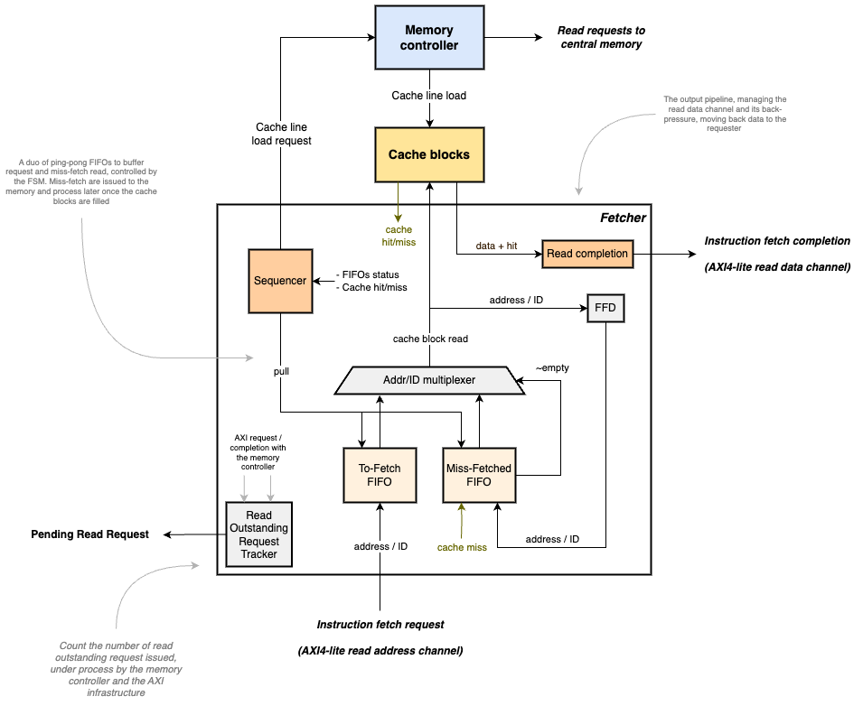
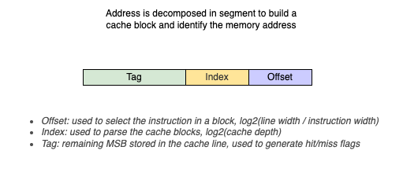
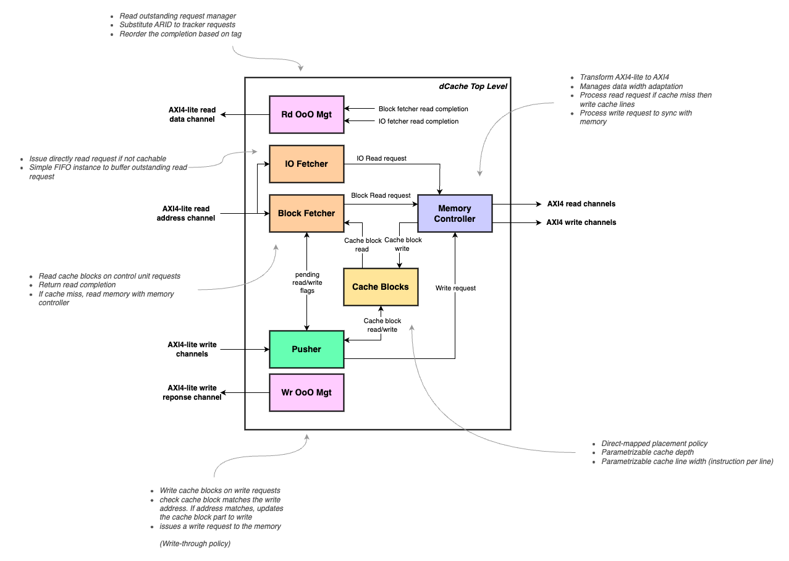

# Architecture

All draws have been created with draw.io, the document being stored in `doc` folder.

The core heavily uses AMBA AXI protocol to connect its module and connect with external components.
Refer to the [AXI](./axi.md) document for more information.


## Top Levels

`Core`

<p align="center">  </p>

The FRISCV core is compact and composed by:
- the control unit, fetching and sequencing the instructions
- the processing unit, executing the arithmetic and memory access instructions
- the cache units, one for instuction bus, one for data bus
- the CSR unit, providing the registers to connect the features and extensions
- the ISA registers, shared between control and processing units


`Platform`

<p align="center">  </p>

The FRISCV platform is a top layer instanciating the core, an [AXI4 crossbar](https://github.com/dpretet/axi-crossbar),
and multiple peripherals to interact with external environment. The platform reserves an AXI4 master
interface to connect a RAM, for instance a DDR controller. This interface can be used by instruction
and data buses. The platform also provides a CLINT implmentatiion, some GPIOs and an UART. All
peripherals use an APB interface, binded by an APB interconnect doing a bridge to the AXI4-lite
land.


## Control Unit

<p align="center">  </p>

The control unit is the central piece of the core. It acts as a sequencer to fetch and distribute
instructions across the hart. The unit is composed by several pieces:

- The central FSM sequencing the execution
- The program counter management based on current instruction to execute
- A FIFO to buffer the incoming instructions
- An instruction decoder to decompose the machine code and ease the processing

<p align="center">  </p>

The FSM sequencing the operations manages the PC (program counter) and acts depending the incoming
instructions. It activates the processing unit, manages the jump/branch instruction or read/write
the CSRs.

The control unit pre-loads the next instructions through an AXI4-lite interface, using its
non-blocking nature to read multiple outstanding requests and so unleash the performance of the
core. In case a jump or a branching is necessary, it will drop the next useless incoming requests
and reboot a new batch of requests up to the next jump.

<p align="center">  </p>

The above figure illustrates a processor booting at address `0x0`, issuing multiple outstanding
requests. Addresses from `0x0` to `0x2` return instructions to execute in the next cycle but address
`0x3` returns a JAL (jump) to move to address `0xA`. So outstanding requests coming back with
addresses `0x4` and `0x5` are discarded and only instructions from `0xA` will be used. To identify
this new memory section read, the control unit increments the address channel ID when jumping to
ease this batch identification.

The FIFO present as a front-end of the module is very important to store incoming instructions in
case the processing unit, the CSRs are not ready to execute an instruction (for instance if reading
the external central memory).

In case the control unit pre-loaded too much instruction while a branch needs to be taken, it can
flush the front-end FIFO and the iCache buffer and restarts faster to follow the new branch.

The controls unit also manages the exceptions occuring and the traps (asynchronous or synchronous).


## CSR Unit

The core implements in a dedicated module the supported registers described in the ISA manuel volume
2 (privileged specification). Read and write in CSR registers is atomic and stall the core as long
the instruction is not complete.

The core implements the following CSR registers into the dedicated module:

- mhartid (RO)
- mstatus (RW)
- misa (RW)
- mie (RW)
- mip (RW)
- mtvec (RW)
- mcounteren (RW)
- mscratch (RW)
- mepc (RW)
- mcause (RW)
- mtval (RW)
- rdcycle (RO)
- rdtime (RO)
- rdinstret (RO)

Next CSRs are available as a memory-mapped peripheral:

- mtime (RO)
- mtimecmp (RW)

They are not available if using only the [core](../rtl/friscv_rv32i_core.sv) module but only its
ready-to-use [platform](../rtl/friscv_rv32i_platform.sv) module including the core and an AXI4
crossbar to connect the peripherals.


## Processing Unit

The processing unit encloses the memory controller managing LOAD/STORE instructions and the ALU unit
managing the arithmetic and logical instructions. It's nowadays very simple and executes the
instructions in-order.

<p align="center">  </p>


## Cache Units

The cache units are local memories, managed by controllers which store locally data and instruction
to ensure fast access. It serves read/write requests from the core to load and store data
very close to the control unit instead of relying on system memory which can be far
and so slow to access.

Data and instruction are stored in local memory, the cache blocks, stored along tags to determine
during a read/write request f is available (cache hit) and not (cache miss). 

Explanations about the basics of cache layers can be found in this [document](./cache_layers.md).

### Instruction Cache

<p align="center">  </p>

The instruction cache stage acts a local buffer storing the most frequently used instructions to
avoid doing read requests to the central memory, which would take significantly longer time to be
accessed than a local memory. This stage increases the bandwidth when fetching the next instructions
to process and thus increases the overall processor performance.

Features:

- Direct-mapped placement policy
- Parametrizable cache depth
- Parametrizable cache line width
- Parametrizable number of outstanding requests
- Software-based flush control with FENCE.i instruction
- Transparent operation for user, no need of any kind of management
- Cache prefetch can be activated in the internal memory controller to enhance efficiency
- AXI4-lite slave interface to fetch an instruction
- AXI4 master interface to read the system memory


#### Block-Fetcher

The cache unit is built around the central FSM, the fetcher stage:

<p align="center">  </p>

The fetch stage receives the read request from the control unit and parses the caches blocks to find
the requested instructions. As long the instructions are available in the cache, the fetcher uses
the input read address channel once a cache-miss is reached, the missing address is stored in the a
buffer. Then, the memory controller reads the central memory with the missing address and fills the
cache blocks to serve again the miss-fetch request. The fetcher stage navigates back and forth
between the two sources, between the cache blocks and the memory controller.


#### Cache Blocks

<p align="center">  </p>

The cache blocks are organized with a direct-mapped cache architecture. Each line width can be
configured as well the number of cache lines (the cache depth). Each line stores the tag, the
instuctions and the set bit. The tag is the part of an address's MSB used to identify the real
address stored, the set bit indicates if this lines as been already written or not.

<p align="center">  </p>

The above figure illustrates how an address is exploited to organize and retrive an instruction:

addr = | tag | index | offset |

- offset: log2(nb instructions per block) bits, selects the right instruction in the cache block
- index:  log2(cache depth) bits, selects a cache block in the pool
- tag:    the remaining MSBs, the part helping to determine a cache hit/miss


### Data Cache

<p align="center">  </p>

The data cache (dCache) relies on the same read flow than iCache. The differences are the dCache
implements a write flow and manages read re-ordering.

Features:

- Direct-mapped placement policy
- Write-through policy for write management
- Parametrizable cache depth
- Parametrizable cache line width
- Parametrizable number of outstanding requests
- IO Region configurable to manage uncachable requests
- Cache prefetch can be activated in the internal memory controller to enhance efficiency
- AXI4-lite slave interface to fetch an instruction
- AXI4 master interface to read/write the system memory

#### Write Path

<p align="center">  </p>

Pusher stage manages the write path, updating the cache blocks if the address to write is cached
and issuing write request to the memory. It can buffer a certain number of write requests to unleash
performance, this number being configurable with a parameter. If a write request targets an IO
region, the application indicates with AWCACHE the request is not cachable and need to be directly
written in the system memory and not in the cache blocks.

#### Read Path

<p align="center">  </p>

The read path, if needs to manage IO region read requests multiplexes the Block-Fetcher and
IO-Fetcher modules based on the ARCACHE attribute. IO-Fetcher is always serviced first to issue
request to the memory controller. This path is needed to manage IO R/W while these data are not
cachable.


#### Read Out-Of-Order Management

<p align="center">  </p>

Read request can target either an IO region or a cachable region, the application needs to
indicate this information with ARCACHE. Block-Fetcher stage (same module than iCache) manages the
read request in the cache blocks, IO-Fetcher manages the IO request to route directly in the memory
with the memory controller. Because read request can come back out-of-order with the latency
different between block and memory, the dCache uses one more module to manage that. The OoO Manager
module substitutes ARID to make it unique for each read request and uses them to reorder the read
data completion to the application. This stage can be deactivated if not necessary, if the
application can manage by itself the reordering or if doesn't target IO region (Block-Fetcher always
completes requets in-order).


#### AXI4 Ordering Rules

AXI doesn't provide advanced ordering rules and instructs the user to issue first a sequence of
write then a sequence of read only once write completions have been all received (and vice versa).
Internally, the cache could still processing or waiting for write requests while the application is
already able to issue new series of R/W requests. The cache manages that situation by monitoring all
read and write modules and block any situation that could lead to read / write collision and data
integrity corruption.

However, the read and write path always buffer request with FIFO, preventing to slow down the
application performance. Only the processing of the request will be stopped, the communication with
the cache will remain active as long the FIFO are not full.


## Interrupts

The core and the platform supports few interrupts:

- MEIP, External IRQ: an input from any external source
- MTIP, timer IRQ: MTIME & MTIMECMP CSRs, connected in a memory-mapped peripheral (the CLINT module)
- MSIP(i) software IRQ input: an input from another hart
- MSIP(o) software IRQ output: an output to trigger another hart

The core always handles in its clock domain the interrupts by synchronizing them through a two-stage
FFDs.

The MTIP/MSIP interrupts are implemented in a controller most commonly named CLINT (Core Local
Interrupt). MSIP(o) output is used to trigger another hart with a software interrupt. MTIP, MEIP &
MSIP(i) inputs are directly connected in the CSR management module described above.


| name         | address | mode | description                                                       |
|--------------|---------|------|-------------------------------------------------------------------|
| MSIP(o)      | 0x00    | RW   | Output software interrupt MSIP to<br>trigger another core (1 bit) |
| MTIME LSB    | 0x04    | RW   | MTIME CSR bit [31:0]                                              |
| MTIME MSB    | 0x08    | RW   | MTIME CSR bit [63:32]                                             |
| MTIMECMP LSB | 0x0C    | RW   | MTIMECMP CSR bit [31:0]                                           |
| MTIMECMP MSB | 0x10    | RW   | MTIMECMP CSR bit [63:32]                                          |


## IO Peripherals

The IOs are connected to a master port of the crossbar through a sub-system interconnect. The IO
modules use APB protocol, so requests from the core are first translated from/to AXI4-lite with
an APB interconnect. Only one module can be read at a time, meaning if the requseter use an
interface wider than 32 bits (usually the case to maximize cache blocks width), one can't read 
4 registers in one read request, but only one, register per register.

If the interface is 128 bits wide, a requester could read up to four 32 bits registers, but the read 
completion will be regarding the offset:

```
Addr 0x0 : 0x00000000 - 0x00000000 - 0x00000000 - 0xABCD4321
Addr 0x4 : 0x00000000 - 0x00000000 - 0xABCD4321 - 0x00000000
Addr 0x8 : 0x00000000 - 0xABCD4321 - 0x00000000 - 0x00000000
Addr 0xc : 0xABCD4321 - 0x00000000 - 0x00000000 - 0x00000000
```

`0xABCD4321` being an hypothetic register value. This is transparent for software while always reading
up to 32 bits for RV32i. The AXI4-lite bridge only manages 32 bits aligned address. 

### GPIOS

The GPIOs are binded behind two registers, one for the outputs, one for the inputs:

| name    | address | mode | description                     |
|---------|---------|------|---------------------------------|
| Outputs | 0x00    | RW   | 32 bits general purpose outputs |
| Inputs  | 0x04    | RO   | 32 bits general purpose inputs  |


Reading and writing a GPIOs' register is never blocking.


### UART

The UART uses few IOs:

- `rx`: serial input, data from an external transmitter
- `tx`: serial output, data to an external receiver
- `rts`: back-pressure flag to indicate the core can't receive anymore data
- `cts`: back-pressure flag to indicate the external receiver can't receive data anymore

The UART uses a FIFO to store data to transmit, and another to store data received. If the FIFOs are
full, the UART can't receive anymore data and rises the RTS flag, or can't transmit anymore and
block the APB bus until the receiver desasserts its CTS flag.

The UART owns few registers. Any attempt to write in a read-only (`RO`) register or a reserved field
will be without effect and can't change the register content neither the engine behavior. Read-write
(`RW`) registers can be written partially by setting properly the WSTRB signal. A read in a write-only
(`WO`) register is not garanteed to return a valid value written previously.

If a transfer (RX or TX) is active and the enable bit is setup back to 0, the transfer will
terminate only after the complete frame transmission.


| name             | address | mode | description                                                                                                                                                                                                                                                                                                                                                                                                                                                                                                                                                                                                                                                                                                                                         |
|------------------|---------|------|-----------------------------------------------------------------------------------------------------------------------------------------------------------------------------------------------------------------------------------------------------------------------------------------------------------------------------------------------------------------------------------------------------------------------------------------------------------------------------------------------------------------------------------------------------------------------------------------------------------------------------------------------------------------------------------------------------------------------------------------------------|
| Control / Status | 0x00    | RW   | [0] Enable the UART engine (both RX and TX) [RW]<br>[1] Loopback mode, every received data will be stored in RX FIFO and forwarded back to TX [RW]<br>[2] Enable parity bit [RW]<br>[3] 0 for even parity, 1 for odd parity [RW]<br>[4] 0 for one stop bit, 1 for two stop bits [RW]<br>[7:5] Reserved<br>[8] Busy flag, the UART engine is processing (RX or TX) [RO]<br>[9] TX FIFO is empty [RO]<br>[10] TX FIFO is full [RO]<br>[11] RX FIFO is empty [RO]<br>[12] RX FIFO is full [RO]<br>[13] UART RTS, flagging it can't receive anymore data [RO]<br>[14] UART CTS, flagging it can't send anymore data [RO]<br>[15] Parity error of the last RX transaction [RO]<br>[31:16] Reserved |
| Clock Divider    | 0x04    | RW   | The number of CPU core cycles to divide down to get the UART data bit rate (baud rate).<br><br>[15:0] Clock divider<br>[31:16] Reserved<br><br>An update during an ongoing operation will certainly lead to compromise the transfer <br>integrity and possibly make unstable the UART engine. The user is advised to configure <br>the baud rate during start-up and be sure the engine is disabled before changing this value.                                                                                                                                                                                                                                                                                                             |
| TX FIFO          | 0x08    | RW   | Push data into TX FIFO. Writing into this register will block the APB write <br>request if TX FIFO is full, until the engine transmit a new word.<br><br>[7:0] data to write<br>[31:8] Reserved                                                                                                                                                                                                                                                                                                                                                                                                                                                                                                                                               |
| RX FIFO          | 0x0C    | RO   | Pull data from RX FIFO. Reading into this register will block the APB read <br>request if FIFO is empty, until the engine receives a new word.<br><br>[7:0] data ready to be read<br>[31:8] Reserved                                                                                                                                                                                                                                                                                                                                                                                                                                                                                                                                          |


Current limitations:
- only support 8 bits wide data word
- no parity support
- no loopback mode
- no interrupt supported
- be able to free the FIFOs with a register bit when disabling the module
