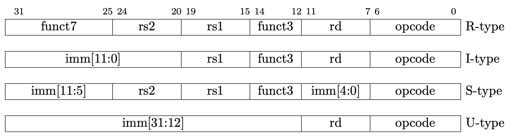

# Chapter 1 - Introduction

An ISA separated into a small base integer ISA, usable by itself as a base for
customized accelerators or for educational purposes, and optional standard
extensions, to support general-purpose development

Support for the revised 2008 IEEE-754 floating-point standard [7].

An ISA supporting extensive ISA extensions and specialized variants.

Both 32-bit and 64-bit address space variants for applications, operating
system kernels, and hardware implementations.

An ISA with support for highly-parallel multicore or manycore implementations,
including heterogeneous multiprocessors.

Optional variable-length instructions to both expand available instruction
encoding space and to support an optional dense instruction encoding for
improved performance, static code size, and energy efficiency.

A fully virtualizable ISA to ease hypervisor development.

The RISC-V ISA is defined avoiding implementation details as much as possible

## 1.1 RISC-V Hardware Platform Terminology

A component is termed a core if it contains an independent instruction fetch
unit. A RISC-V- compatible core might support multiple RISC-V-compatible
hardware threads, or harts, through multithreading.

A RISC-V core might have additional specialized instruction-set extensions or
an added coprocessor.

We use the term accelerator to refer to either a non-programmable
fixed-function unit or a core that can operate autonomously but is specialized
for certain tasks. An important class of RISC-V accelerators are I/O
accelerators, which offload I/O processing tasks from the main application
cores.

The system-level organization of a RISC-V hardware platform can range from a
single-core micro- controller to a many-thousand-node cluster of shared-memory
manycore server nodes.

## 1.2 RISC-V Software Execution Environments and Harts

A RISC-V execution environment interface (EEI) defines
- the initial state of the program
- the number and type of harts in the environment including the privilege modes
  supported by the harts
- the accessibility and attributes of memory and I/O regions
- the behavior of all legal instructions executed on each hart (i.e., the ISA
  is one component of the EEI)
- the handling of any interrupts or exceptions raised during execution
  including environment calls

Examples of EEIs include the Linux application binary interface (ABI), or the
RISC-V supervisor binary interface (SBI).

Examples of execution environment implementations include:

- “Bare metal” hardware platforms where harts are directly implemented by
  physical processor threads and instructions have full access to the physical
  address space. The hardware platform defines an execution environment that
  begins at power-on reset.
- RISC-V operating systems that provide multiple user-level execution
  environments by multiplexing user-level harts onto available physical
  processor threads and by controlling access to memory via virtual memory.
- RISC-V hypervisors that provide multiple supervisor-level execution
  environments for guest operating systems.
- RISC-V emulators, such as Spike, QEMU or rv8, which emulate RISC-V harts on
  an under- lying x86 system, and which can provide either a user-level or a
  supervisor-level execution environment.

From the perspective of software running in a given execution environment, a
hart is a resource that autonomously fetches and executes RISC-V instructions
within that execution environment.

## RISC-V ISA Overview

A RISC-V ISA is defined as a base integer ISA, which must be present in any
implementation, plus optional extensions to the base ISA.

A base is carefully restricted to a minimal set of instructions sufficient to
provide a reasonable target for compilers, assemblers, linkers, and operating
systems.

- The base integer ISA is named “I” (prefixed by RV32 or RV64 depending on
  integer register width), and contains integer computational instructions,
  integer loads, integer stores, and control- flow instructions.
- The standard integer multiplication and division extension is named “M”, and
  adds instructions to multiply and divide values held in the integer
  registers.
- The standard atomic instruction extension, denoted by “A”, adds instructions
  that atomically read, modify, and write memory for inter-processor
  synchronization.
- The standard single-precision floating-point exten- sion, denoted by “F”,
  adds floating-point registers, single-precision computational instructions,
  and single-precision loads and stores.
- The standard double-precision floating-point extension, denoted by “D”,
  expands the floating-point registers, and adds double-precision computational
  instruc- tions, loads, and stores.
- The standard “C” compressed instruction extension provides narrower 16-bit
  forms of common instructions.

## 1.4 Memory

A RISC-V hart has a single byte-addressable address space of 2XLEN bytes for
all memory accesses.

The execution environment determines the mapping of hardware resources into a
hart’s address space. Different address ranges of a hart’s address space may
(1) be vacant, or (2) contain main memory, or (3) contain one or more I/O
devices. Reads and writes of I/O devices may have visible side effects, but
accesses to main memory cannot. Although it is possible for the execution
environment to call everything in a hart’s address space an I/O device, it is
usually expected that some portion will be specified as main memory.

When a RISC-V platform has multiple harts, the address spaces of any two harts
may be entirely the same, or entirely different, or may be partly different but
sharing some subset of resources, mapped into the same or different address
ranges.

Executing each RISC-V machine instruction entails one or more memory accesses,
subdivided into implicit and explicit accesses. For each instruction executed,
an implicit memory read (instruction fetch) is done to obtain the encoded
instruction to execute. Many RISC-V instructions perform no further memory
accesses beyond instruction fetch. Specific load and store instructions perform
an explicit read or write of memory at an address determined by the
instruction. The execution environment may dictate that instruction execution
performs other implicit memory accesses (such as to implement address
translation) beyond those documented for the unprivileged ISA.

The execution environment determines what portions of the non-vacant address
space are accessible for each kind of memory access. Ordinarily, if an
instruction attempts to access memory at an inaccessible address, an exception
is raised for the instruction. Vacant locations in the address space are never
accessible.

The memory accesses (implicit or explicit) made by a hart may appear to occur
in a different order as perceived by another hart or by any other agent that
can access the same memory. This perceived reordering of memory accesses is
always constrained, however, by the applicable memory consistency model. The
default memory consistency model for RISC-V is the RISC-V Weak Memory Ordering
(RVWMO).

## 1.5 Base Instruction-Length Encoding

The base RISC-V ISA has fixed-length 32-bit instructions that must be naturally
aligned on 32-bit boundaries. However, the standard RISC-V encoding scheme is
designed to support ISA extensions with variable-length instructions, where
each instruction can be any number of 16-bit instruction parcels in length and
parcels are naturally aligned on 16-bit boundaries. The standard compressed ISA
extension described in Chapter 16 reduces code size by providing compressed
16-bit instructions and relaxes the alignment constraints to allow all
instructions (16 bit and 32 bit) to be aligned on any 16-bit boundary to
improve code density.

## 1.6 Exceptions, Traps, and Interrupts

We use the term exception to refer to an unusual condition occurring at run
time associated with an instruction in the current RISC-V hart. We use the term
interrupt to refer to an external asynchronous event that may cause a RISC-V
hart to experience an unexpected transfer of control. We use the term trap to
refer to the transfer of control to a trap handler caused by either an
exception or an interrupt.

Traps encountered by a hart at runtime can have four different effects:

- Contained Trap: The trap is visible to, and handled by, software running
  inside the execution environment.
- Requested Trap: The trap is a synchronous exception that is an explicit call
  to the execution environment requesting an action on behalf of software
  inside the execution environment.
- Invisible Trap: The trap is handled transparently by the execution
  environment and execution resumes normally after the trap is handled.
- Fatal Trap: The trap represents a fatal failure and causes the execution
  environment to terminate execution.

## 1.7 UNSPECIFIED Behaviors and Values

The architecture fully describes what implementations must do and any
constraints on what they may do. In cases where the architecture intentionally
does not constrain implementations, the term unspecified is explicitly used.

# Chapter 2 - RV32I Base Integer Instruction Set, Version 2.1

RV32I was designed to be sufficient to form a compiler target and to support
modern operating system environments. The ISA was also designed to reduce the
hardware required in a minimal implementation. RV32I contains 40 unique
instructions, though a simple implementation might cover the ECALL/EBREAK
instructions with a single SYSTEM hardware instruction that always traps and
might be able to implement the FENCE instruction as a NOP, reducing base
instruction count to 38 total. RV32I can emulate almost any other ISA extension
(except the A extension, which requires additional hardware support for
atomicity).

In practice, a hardware implementation including the machine-mode privileged
architecture will also require the 6 CSR instructions.

Subsets of the base integer ISA might be useful for pedagogical purposes, but
the base has been defined such that there should be little incentive to subset
a real hardware implementation beyond omitting support for misaligned memory
accesses and treating all SYSTEM instrctions as a single trap.

## 2.1 Programmers’ Model for Base Integer ISA

For RV32I, the 32 x registers are each 32 bits wide, i.e., XLEN=32. Register x0
is hardwired with all bits equal to 0. General purpose registers x1–x31 hold
values that various instructions interpret as a collection of Boolean values,
or as two’s complement signed binary integers or unsigned binary integers.

For RV32I, the 32 x registers are each 32 bits wide, i.e., XLEN=32. Register x0
is hardwired with all bits equal to 0. General purpose registers x1–x31 hold
values that various instructions interpret as a collection of Boolean values,
or as two’s complement signed binary integers or unsigned binary integers.

There is one additional unprivileged register: the program counter pc holds the
address of the current instruction.

There is no dedicated stack pointer or subroutine return address link register
in the Base Integer ISA; the instruction encoding allows any x register to be
used for these purposes. However, the standard software calling convention uses
register x1 to hold the return address for a call, with register x5 available
as an alternate link register. The standard calling convention uses register x2
as the stack pointer.

Hardware might choose to accelerate function calls and returns that use x1 or
x5. See the descriptions of the JAL and JALR instructions.

## 2.2 Base Instruction Formats

In the base RV32I ISA, there are four core instruction formats (R/I/S/U).

All are a fixed 32 bits in length and must be aligned on a four-byte boundary
in memory. An instruction-address-misaligned exception is generated on a taken
branch or unconditional jump if the target address is not four-byte aligned.
This exception is reported on the branch or jump instruction, not on the target
instruction. No instruction-address-misaligned exception is generated for a
conditional branch that is not taken.

  <!--img width="100" height="100" src=""-->
  

The RISC-V ISA keeps the source (rs1 and rs2) and destination (rd) registers at
the same position in all formats to simplify decoding. Except for the 5-bit
immediates used in CSR instructions (Chapter 9), immediates are always
sign-extended, and are generally packed towards the leftmost available bits in
the instruction and have been allocated to reduce hardware complexity. In
particular, the sign bit for all immediates is always in bit 31 of the
instruction to speed sign-extension circuitry.

## 2.3 Immediate Encoding Variants
